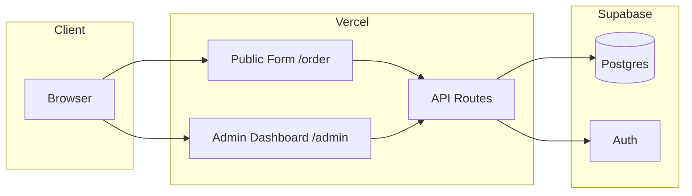
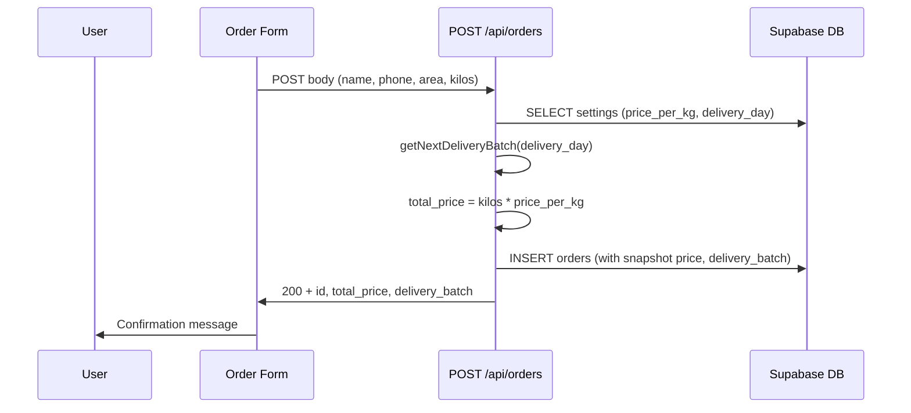

# Architecture and Design

**Purpose:** System architecture, components, data flow, tech stack, and design decisions.

**See also:** [PROJECT_CONTEXT.md](PROJECT_CONTEXT.md), [lib/delivery.ts](../lib/delivery.ts), [lib/supabase/server.ts](../lib/supabase/server.ts), [middleware.ts](../middleware.ts), [04-api.md](04-api.md), [docs index](README.md).

---

## System architecture overview

- **Vercel** hosts the Next.js app: public order form, admin dashboard, and API routes.
- **Supabase** provides Postgres (orders, settings) and Auth (admin only). API routes use the service-role client server-side for DB writes and for public order creation.

---

## Component view

| Component | Path / location | Responsibility |
|-----------|-----------------|----------------|
| Public order form | `/order` → [app/order/page.tsx](../app/order/page.tsx) | Fetch public settings, submit order via POST /api/orders. |
| Admin dashboard | `/admin/*` | Layout with nav; orders list/filters/actions; settings form; login. |
| Middleware | [middleware.ts](../middleware.ts) | Protect `/admin/*`; redirect unauthenticated to `/admin/login`; redirect logged-in users from login to `/admin/orders`. |
| API routes | [app/api/](../app/api/) | Orders (POST public, GET/PATCH admin), settings (GET/PUT admin, GET public), export PDF/Excel. |
| Supabase server | [lib/supabase/server.ts](../lib/supabase/server.ts) | `createClient()` (cookies/session), `createServiceRoleClient()` (bypass RLS, server-only). |
| Delivery helper | [lib/delivery.ts](../lib/delivery.ts) | `getNextDeliveryBatch(deliveryDay)` → next occurrence of that day as YYYY-MM-DD. |

**Public flow:** `/order` → `GET /api/settings/public` → user fills form → `POST /api/orders` (server uses service role, reads settings, computes delivery batch and price, inserts order).

**Admin flow:** `/admin/*` → middleware checks session → pages/API use session; API routes call `getSession()` then `createServiceRoleClient()` for DB access.

---

## Data flow: order submission

---

## Technology stack

| Layer | Technology | Notes |
|-------|------------|--------|
| Frontend | Next.js (App Router) | Single app for form + admin; SSR. |
| Styling | Tailwind CSS | Responsive, utility-first. |
| Backend/API | Next.js API Routes | No separate backend server. |
| Database | Supabase (Postgres) | Hosted; RLS enabled. |
| Auth | Supabase Auth | Admin only (email/password). |
| PDF | @react-pdf/renderer | Server-side in API route. |
| Excel | ExcelJS | Server-side in API route. |
| Hosting | Vercel | Free tier; CDN. |

---

## Design decisions and rationale

| Decision | Rationale |
|----------|-----------|
| No customer auth | Lower friction; identify by phone. |
| Snapshot price at order time | `price_per_kg` and `total_price` stored per order; no retroactive change when settings change. |
| Admin auth only | Supabase Auth; one or few admin users. |
| Public order via API + service role | Validate and set delivery_batch and price on server; RLS blocks direct anon access to orders. |
| PDF server-side only | Use @react-pdf/renderer in API route; no heavy PDF lib on client. |
| Mobile-first | Touch-friendly, minimal JS on form, fast first load on slow networks. |

---

*Update notes: Initial version; reflects codebase as of 2026-02-24.*
